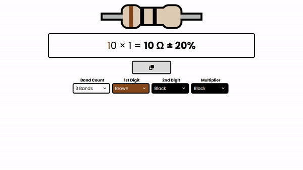

# Resistor Decoder

A tiny web app made in Svelte and Vite that decodes your resistors.

<https://elektr1x.github.io/resistor-decoder>



---

## Running Locally

To run this web app locally, run these commands in the root folder:

```bash
npm i             # installs dependencies
npm run build     # builds the website in ./dist
npm run preview   # starts the website
```

The app should now be online at `localhost:4173`.
